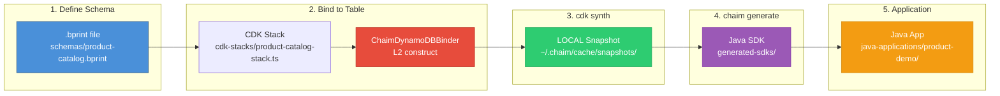

# AI Agent Context: chaim-examples-java

**Purpose**: Structured context for AI agents to understand the complete Chaim OSS workflow through a working example.

**Package**: `@chaim-tools/examples-java` (reference implementation, not published)  
**Version**: 0.1.0  
**License**: Apache-2.0

---

## Project Overview

This repository is a **complete, working reference implementation** demonstrating the entire Chaim OSS ecosystem end-to-end. It serves as both documentation and a template for users getting started with Chaim tools.

> **This is the "hello world" of Chaim** — everything from schema definition to running Java code that interacts with DynamoDB.

### What This Repository Demonstrates

| Step | Tool | Artifact | Description |
|------|------|----------|-------------|
| 1 | Schema author | `.bprint` file | Define entity shape, fields, and keys |
| 2 | `chaim-cdk` | CDK stack | Bind schema to DynamoDB table |
| 3 | `cdk synth` | LOCAL snapshot | Write metadata to OS cache |
| 4 | `chaim-cli` | Java SDK | Generate DTOs, repositories, config |
| 5 | Maven | Compiled JAR | Build the generated code |
| 6 | Java app | Running application | Use the SDK to interact with DynamoDB |

### Key Insight: Code Generation Without Deploy

**LOCAL snapshots are written during `cdk synth`**, not just `cdk deploy`. This means:
- You can generate Java code **without AWS credentials**
- You can generate code **before the table exists**
- CI/CD can generate code in a build step, deploy in a separate step

---

## Related Packages

| Package | Relationship | Purpose |
|---------|-------------|---------|
| `@chaim-tools/chaim-bprint-spec` | **Schema format** | Defines `.bprint` file structure and validation |
| `@chaim-tools/cdk-lib` | **Infrastructure** | CDK constructs that write LOCAL snapshots |
| `@chaim-tools/chaim` (chaim-cli) | **Code generation** | Reads snapshots, generates Java SDK |
| `@chaim-tools/client-java` | **Generator engine** | Internal dependency of chaim-cli |

### Data Flow



**Color Legend:**
- 🔵 **Blue** = User-authored schema
- 🔴 **Red** = Chaim CDK construct (the binding)
- 🟢 **Green** = Auto-generated snapshot (synth-time)
- 🟣 **Purple** = Auto-generated Java code
- 🟠 **Orange** = User application code

---

## Technology Stack

| Component | Technology |
|-----------|------------|
| Language (CDK) | TypeScript 5.x |
| Language (Application) | Java 11+ |
| Build (CDK) | npm |
| Build (Java) | Maven 3.6+ |
| Infrastructure | AWS CDK v2 |
| Data Store | AWS DynamoDB |
| Code Generation | chaim-cli + chaim-client-java |
| ORM | AWS DynamoDB Enhanced Client |
| Boilerplate Reduction | Lombok |

---

## Repository Structure

```
chaim-examples-java/
├── schemas/                          # Step 1: .bprint schema definitions
│   ├── product-catalog.bprint       # 📋 Primary example (composite key)
│   └── orders.bprint                 # Legacy example (single key)
│
├── cdk-stacks/                       # Step 2: AWS CDK infrastructure
│   ├── app.ts                        # CDK app entry point
│   ├── product-catalog-stack.ts     # 🏗️ ProductCatalogStack with ChaimDynamoDBBinder
│   ├── orders-infrastructure-stack.ts
│   └── orders-application-stack.ts
│
├── generated-sdks/                   # Step 4: Generated Java code (gitignored)
│   ├── productcatalogstack-sdk/      # Output for ProductCatalogStack
│   │   └── com/acme/products/
│   │       ├── Products.java         # Entity DTO
│   │       ├── config/ChaimConfig.java
│   │       ├── client/ChaimDynamoDbClient.java
│   │       ├── keys/ProductsKeys.java
│   │       └── repository/ProductsRepository.java
│   └── README.md                     # Explains gitignore strategy
│
├── java-applications/                # Step 6: Example applications
│   ├── product-demo/                 # 🎯 Primary demo using generated SDK
│   │   ├── src/main/java/com/acme/demo/
│   │   │   └── ProductCatalogDemo.java
│   │   └── pom.xml
│   └── orders-app/                   # Legacy orders demo
│
├── scripts/                          # Automation scripts
│   ├── synth-and-generate.sh        # 🔧 Complete workflow: synth → generate → pom
│   └── *.sh                          # Other helper scripts
│
├── templates/                        # Build templates
│   └── sdk-pom.xml.template         # Maven POM template for generated SDKs
│
├── cdk.json                          # CDK configuration
├── tsconfig.json                     # TypeScript configuration
├── package.json                      # Node.js dependencies
└── CHAIM_CONTEXT.md                  # This file
```

---

## The Complete Workflow

### Step 1: Define Schema (`.bprint` file)

```json
// schemas/product-catalog.bprint
{
  "schemaVersion": 1.0,
  "namespace": "acme.ecommerce.products",
  "entity": {
    "name": "Product",
    "primaryKey": {
      "partitionKey": "productId",
      "sortKey": "category"
    },
    "fields": [
      { "name": "productId", "type": "string", "required": true },
      { "name": "category", "type": "string", "required": true },
      { "name": "name", "type": "string", "required": true },
      { "name": "price", "type": "number", "required": true },
      { "name": "stockQuantity", "type": "number", "required": true },
      { "name": "isActive", "type": "boolean", "default": true },
      { "name": "createdAt", "type": "timestamp", "required": true }
    ]
  }
}
```

**Key points:**
- `schemaVersion` must be a number (`1.0`), not string
- `primaryKey.partitionKey` and `primaryKey.sortKey` reference field names
- Fields with `required: true` generate validation in the SDK

### Step 2: Create CDK Stack with ChaimDynamoDBBinder

```typescript
// cdk-stacks/product-catalog-stack.ts
import { ChaimDynamoDBBinder, ChaimCredentials, FailureMode } from '@chaim-tools/cdk-lib';

// Create table matching schema's key structure
const productTable = new dynamodb.Table(this, 'ProductTable', {
  tableName: 'product-catalog',
  partitionKey: { name: 'productId', type: dynamodb.AttributeType.STRING },
  sortKey: { name: 'category', type: dynamodb.AttributeType.STRING },
});

// Bind schema to table
new ChaimDynamoDBBinder(this, 'ProductSchema', {
  schemaPath: path.join(__dirname, '../schemas/product-catalog.bprint'),
  table: productTable,
  appId: 'chaim-examples-java',
  credentials: ChaimCredentials.fromApiKeys(
    process.env.CHAIM_API_KEY || 'dev-key',
    process.env.CHAIM_API_SECRET || 'dev-secret'
  ),
  failureMode: FailureMode.BEST_EFFORT,
});
```

**Key points:**
- Table keys MUST match schema's `primaryKey` field names
- `ChaimDynamoDBBinder` writes LOCAL snapshot during `cdk synth`
- `FailureMode.BEST_EFFORT` allows deployment even if SaaS publish fails

### Step 3: Synthesize CDK (Creates LOCAL Snapshot)

```bash
npx cdk synth ProductCatalogStack
```

**What happens:**
1. CDK constructs are instantiated
2. `ChaimDynamoDBBinder` constructor runs:
   - Validates `.bprint` schema
   - Extracts DynamoDB table metadata
   - Writes LOCAL snapshot to `~/.chaim/cache/snapshots/`
3. CloudFormation template is written to `cdk.out/`

**LOCAL snapshot location:**
```
~/.chaim/cache/snapshots/
└── aws/
    └── {accountId}/
        └── {region}/
            └── ProductCatalogStack/
                └── dynamodb/
                    └── {resourceId}.json
```

### Step 4: Generate Java SDK

```bash
chaim generate \
  --stack ProductCatalogStack \
  --package com.acme.products \
  --output ./generated-sdks/productcatalogstack-sdk
```

**What happens:**
1. CLI discovers snapshot from OS cache
2. Parses schema and DynamoDB metadata
3. Invokes `chaim-client-java` to generate:
   - `Products.java` — Entity DTO with DynamoDB annotations
   - `ProductsKeys.java` — Key constants
   - `ProductsRepository.java` — CRUD operations
   - `ChaimDynamoDbClient.java` — DI-friendly client
   - `ChaimConfig.java` — Configuration with factory methods

### Step 5: Build Generated SDK

```bash
cd generated-sdks/productcatalogstack-sdk
mvn package
```

### Step 6: Use in Application

```java
// java-applications/product-demo/src/main/java/com/acme/demo/ProductCatalogDemo.java
import com.acme.products.Products;
import com.acme.products.config.ChaimConfig;
import com.acme.products.repository.ProductsRepository;

public class ProductCatalogDemo {
    public static void main(String[] args) {
        // Get repository from generated config
        ProductsRepository repository = ChaimConfig.productsRepository();

        // Create entity
        Products product = new Products();
        product.setProductId("PROD-001");
        product.setCategory("Electronics");
        product.setName("Smart Speaker");
        product.setPrice(149.99);
        product.setStockQuantity(100.0);
        product.setIsActive(true);
        product.setCreatedAt(Instant.now());

        // Save to DynamoDB
        repository.save(product);

        // Find by composite key
        Optional<Products> found = repository.findByKey("PROD-001", "Electronics");
    }
}
```

---

## Key Files Reference

| File | Purpose | When to Modify |
|------|---------|----------------|
| `schemas/product-catalog.bprint` | Entity schema definition | Adding/changing fields, keys |
| `cdk-stacks/product-catalog-stack.ts` | Infrastructure + binder | Changing table config, adding resources |
| `cdk-stacks/app.ts` | CDK app entry point | Adding new stacks |
| `scripts/synth-and-generate.sh` | Workflow automation | Changing generation parameters |
| `templates/sdk-pom.xml.template` | SDK Maven template | Changing SDK dependencies |
| `java-applications/product-demo/pom.xml` | Demo app Maven config | Adding app dependencies |
| `java-applications/product-demo/.../ProductCatalogDemo.java` | Demo application | Demonstrating SDK usage |

---

## Common Tasks

### Add a New Field to Schema

1. Edit `schemas/product-catalog.bprint`:
   ```json
   { "name": "newField", "type": "string", "required": false }
   ```

2. Re-run workflow:
   ```bash
   npx cdk synth ProductCatalogStack
   chaim generate --stack ProductCatalogStack --package com.acme.products --output ./generated-sdks/productcatalogstack-sdk
   cd java-applications/product-demo && mvn compile
   ```

### Add a New Entity (Same Table)

1. Create new `.bprint` file with **matching** PK/SK field names
2. Add another `ChaimDynamoDBBinder` in the CDK stack
3. Re-synth and regenerate

### Add a New Entity (New Table)

1. Create new `.bprint` file
2. Create new CDK stack (or add table + binder to existing stack)
3. Re-synth and regenerate

### Change the Java Package Name

```bash
chaim generate \
  --stack ProductCatalogStack \
  --package com.mycompany.newpackage \
  --output ./generated-sdks/productcatalogstack-sdk
```

Update consumer `pom.xml` to match new package imports.

### Test Without AWS Deployment

The entire generation workflow works **without deploying to AWS**:

```bash
# This is all you need to generate Java code
npx cdk synth ProductCatalogStack
chaim generate --stack ProductCatalogStack --package com.acme.products --output ./generated-sdks

# Demo app compiles (but DynamoDB calls will fail without deployed table)
cd java-applications/product-demo
mvn compile
```

---

## Generated Code Structure

### Entity DTO Pattern

```java
@Data                    // Lombok: getters, setters, equals, hashCode, toString
@Builder                 // Lombok: builder pattern
@NoArgsConstructor       // Lombok: default constructor (required by DynamoDB)
@AllArgsConstructor      // Lombok: all-args constructor
@DynamoDbBean            // AWS SDK: marks as DynamoDB entity
public class Products {
    private String productId;
    private String category;
    // ... other fields

    @DynamoDbPartitionKey
    public String getProductId() { return productId; }

    @DynamoDbSortKey
    public String getCategory() { return category; }
}
```

### Repository Pattern

```java
public class ProductsRepository {
    private final DynamoDbTable<Products> table;

    // Constructor for ChaimDynamoDbClient
    public ProductsRepository(ChaimDynamoDbClient client) { ... }

    // Constructor for testing/DI
    public ProductsRepository(DynamoDbEnhancedClient client, String tableName) { ... }

    public void save(Products entity) { ... }
    public Optional<Products> findByKey(String productId, String category) { ... }
    public void deleteByKey(String productId, String category) { ... }
}
```

### Configuration Pattern

```java
public class ChaimConfig {
    // Baked-in metadata from CDK synth
    public static final String TABLE_NAME = "product-catalog";
    public static final String TABLE_ARN = "arn:aws:dynamodb:...";
    public static final String REGION = "us-east-1";

    // Lazy singleton client
    public static ChaimDynamoDbClient getClient() { ... }

    // Repository factory methods
    public static ProductsRepository productsRepository() { ... }
    public static ProductsRepository productsRepository(ChaimDynamoDbClient client) { ... }
}
```

---

## Snapshot Payload Structure

The LOCAL snapshot contains:

```json
{
  "provider": "aws",
  "accountId": "123456789012",
  "region": "us-east-1",
  "stackName": "ProductCatalogStack",
  "datastoreType": "dynamodb",
  "resourceName": "ProductTable",
  "resourceId": "ProductTable__Products",
  "appId": "chaim-examples-java",
  "schema": { /* .bprint contents */ },
  "dataStore": {
    "tableName": "product-catalog",
    "tableArn": "arn:aws:dynamodb:...",
    "partitionKey": { "name": "productId", "type": "S" },
    "sortKey": { "name": "category", "type": "S" }
  },
  "context": {
    "cdkVersion": "2.x.x",
    "constructPath": "ProductCatalogStack/ProductTable/..."
  },
  "capturedAt": "2026-01-12T..."
}
```

---

## Troubleshooting

### "No snapshot found"

**Cause:** LOCAL snapshot doesn't exist in OS cache.

**Solution:**
```bash
# Create the snapshot first
npx cdk synth ProductCatalogStack

# Then generate
chaim generate --stack ProductCatalogStack --package com.acme.products
```

### "Table must be a concrete DynamoDB Table construct"

**Cause:** Passing an imported table reference instead of a concrete `dynamodb.Table`.

**Solution:** Use `new dynamodb.Table(...)` not `dynamodb.Table.fromTableArn(...)`.

### "Argument of type 'this' is not assignable to parameter of type 'Construct'"

**Cause:** Type mismatch between different `constructs` package versions.

**Solution:** This is fixed in `@chaim-tools/cdk-lib`. Ensure you're using the latest version.

### Java compilation fails with "package does not exist"

**Cause:** Generated SDK sources not in Maven source path.

**Solution:** The `product-demo/pom.xml` uses `build-helper-maven-plugin` to add generated sources. Verify the path is correct.

### DynamoDB operations fail at runtime

**Cause:** Table doesn't exist in AWS.

**Solution:**
```bash
npx cdk deploy ProductCatalogStack
```

---

## npm Scripts Reference

| Script | Command | Description |
|--------|---------|-------------|
| `synth-product-catalog` | `cdk synth ProductCatalogStack` | Generate LOCAL snapshot |
| `generate-product-sdk` | `chaim generate ...` | Generate Java SDK |
| `build-product-demo` | `cd java-applications/product-demo && mvn package` | Build demo app |

---

## Development Commands

| Command | Purpose |
|---------|---------|
| `npm install` | Install Node.js dependencies |
| `npx cdk synth <StackName>` | Synthesize CDK (creates LOCAL snapshot) |
| `npx cdk deploy <StackName>` | Deploy to AWS |
| `chaim generate --stack <Stack> --package <pkg>` | Generate Java SDK |
| `mvn compile` | Compile Java code |
| `mvn exec:java -Dexec.mainClass=<class>` | Run Java application |

---

## Integration Points

### With chaim-cdk

The CDK stack imports `ChaimDynamoDBBinder` from `@chaim-tools/cdk-lib`. During synth:
- Validates schema against `@chaim-tools/chaim-bprint-spec`
- Extracts table metadata (name, ARN, keys)
- Writes LOCAL snapshot to OS cache

### With chaim-cli

The CLI reads from OS cache (`~/.chaim/cache/snapshots/`):
- Discovers snapshots by stack name
- Parses schema and metadata
- Invokes Java generator

### With chaim-client-java

The Java generator receives:
- Array of schema objects
- Table metadata JSON
- Package name and output directory

Produces:
- Entity DTOs with DynamoDB annotations
- Repository classes
- Configuration class

---

## Best Practices Demonstrated

1. **Schema-First Design**: Define `.bprint` schema before infrastructure
2. **Infrastructure as Code**: All resources defined in CDK TypeScript
3. **Separation of Concerns**: Schema, infrastructure, generated code, application code in separate directories
4. **Gitignore Generated Code**: `generated-sdks/` is gitignored; regenerate during build
5. **Type-Safe DynamoDB**: Generated DTOs use Enhanced Client annotations
6. **DI-Friendly**: `ChaimDynamoDbClient` accepts existing clients for testing

---

**Note**: This repository is a reference implementation showing the complete Chaim workflow. For production use, you would typically have separate repositories for infrastructure and application code, with the generated SDK published to a Maven repository or included as a submodule.
