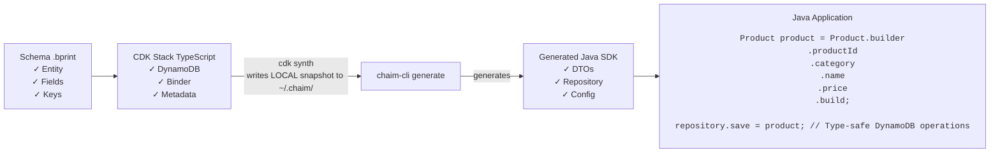

# Chaim Examples Java

**A complete, working example demonstrating the Chaim ecosystem end-to-end.**

This repository shows how to use Chaim tools to:
1. Define data schemas with `.bprint` files
2. Deploy infrastructure with AWS CDK using Chaim L2 constructs
3. Generate type-safe Java SDKs from LOCAL snapshots
4. Build applications using the generated code

## What This Example Demonstrates


## Quick Start

### Prerequisites

- **Node.js** 18+
- **Java** 11+
- **Maven** 3.6+
- **AWS CLI** configured (`aws configure`)
- **AWS CDK CLI** (`npm install -g aws-cdk`)

### Complete Workflow (5 minutes)

```bash
# 1. Clone and navigate to this example
cd chaim-examples-java

# 2. Install dependencies
npm install

# 3. Run the complete workflow (synth + generate + build)
./scripts/synth-and-generate.sh ProductCatalogStack com.acme.products

# 4. Deploy to AWS (optional - code generation works without deploy using 'cdk synth'!)
npx cdk deploy ProductCatalogStack

# 5. Run the demo application
cd java-applications/product-demo
mvn compile exec:java -Dexec.mainClass="com.acme.demo.ProductCatalogDemo"
```

## Project Structure

```
chaim-examples-java/
├── schemas/                          # .bprint schema definitions
│   ├── product-catalog.bprint       # Product entity schema (PK + SK)
│   └── orders.bprint                 # Orders schema (legacy example)
│
├── cdk-stacks/                       # AWS CDK infrastructure code
│   ├── app.ts                        # CDK app entry point
│   ├── product-catalog-stack.ts     # DynamoDB + ChaimDynamoDBBinder
│   └── orders-*.ts                   # Legacy orders stacks
│
├── generated-sdks/                   # Generated Java SDKs (gitignored)
│   └── productcatalogstack-sdk/      # Output from chaim generate
│       ├── src/main/java/
│       │   └── com/acme/products/
│       │       ├── Product.java      # Entity DTO with annotations
│       │       ├── config/
│       │       │   └── ChaimConfig.java
│       │       ├── client/
│       │       │   └── ChaimDynamoDbClient.java
│       │       ├── keys/
│       │       │   └── ProductKeys.java
│       │       └── repository/
│       │           └── ProductRepository.java
│       └── pom.xml
│
├── java-applications/                # Example Java applications
│   └── product-demo/                 # Demo using generated SDK
│       ├── src/main/java/
│       │   └── com/acme/demo/
│       │       └── ProductCatalogDemo.java
│       └── pom.xml
│
├── scripts/                          # Automation scripts
│   └── synth-and-generate.sh        # Complete workflow script
│
├── templates/                        # Build templates
│   └── sdk-pom.xml.template         # Maven POM template for SDK
│
├── cdk.json                          # CDK configuration
└── package.json                      # Node.js dependencies
```

## The Schema (product-catalog.bprint)

```json
{
  "schemaVersion": "v1",
  "namespace": "acme.ecommerce.products",
  "description": "Product catalog for ACME E-Commerce platform",
  "entity": {
    "name": "Product",
    "primaryKey": {
      "partitionKey": "productId",
      "sortKey": "category"
    },
    "fields": [
      { "name": "productId", "type": "string", "required": true },
      { "name": "category", "type": "string", "required": true },
      { "name": "name", "type": "string", "required": true },
      { "name": "price", "type": "number", "required": true },
      { "name": "stockQuantity", "type": "number", "required": true },
      { "name": "isActive", "type": "boolean", "default": true },
      { "name": "createdAt", "type": "timestamp", "required": true }
    ]
  }
}
```

## The CDK Stack (product-catalog-stack.ts)

```typescript
import { ChaimDynamoDBBinder, ChaimCredentials, FailureMode } from '@chaim-tools/cdk-lib';

// Create DynamoDB table matching schema's primary key
const productTable = new dynamodb.Table(this, 'ProductTable', {
  tableName: 'acme-product-catalog',
  partitionKey: { name: 'productId', type: dynamodb.AttributeType.STRING },
  sortKey: { name: 'category', type: dynamodb.AttributeType.STRING },
  billingMode: dynamodb.BillingMode.PAY_PER_REQUEST,
});

// Bind schema to table - writes LOCAL snapshot during cdk synth
new ChaimDynamoDBBinder(this, 'ProductSchema', {
  schemaPath: './schemas/product-catalog.bprint',
  table: productTable,
  appId: 'chaim-examples-java',
  credentials: ChaimCredentials.fromApiKeys(
    process.env.CHAIM_API_KEY,
    process.env.CHAIM_API_SECRET
  ),
  failureMode: FailureMode.BEST_EFFORT,
});
```

## Generated Java SDK

After running `chaim generate`, you get:

### Entity DTO (Product.java)

```java
@Data
@Builder
@NoArgsConstructor
@AllArgsConstructor
@DynamoDbBean
public class Product {
    private String productId;
    private String category;
    private String name;
    private Double price;
    private Double stockQuantity;
    private Boolean isActive;
    private Instant createdAt;

    @DynamoDbPartitionKey
    public String getProductId() { return productId; }

    @DynamoDbSortKey
    public String getCategory() { return category; }
}
```

### Repository (ProductRepository.java)

```java
public class ProductRepository {
    private final DynamoDbTable<Product> table;

    public void save(Product entity) { ... }
    
    public Optional<Product> findByKey(String productId, String category) { ... }
    
    public void deleteByKey(String productId, String category) { ... }
}
```

### Configuration (ChaimConfig.java)

```java
public class ChaimConfig {
    // Table metadata baked in from CDK synth
    public static final String TABLE_NAME = "acme-product-catalog";
    public static final String TABLE_ARN = "arn:aws:dynamodb:...";
    public static final String REGION = "us-east-1";

    // Factory methods
    public static ProductRepository productRepository() { ... }
    public static ChaimDynamoDbClient getClient() { ... }
}
```

## Using the Generated SDK

```java
// Get repository from generated config
ProductRepository repository = ChaimConfig.productRepository();

// Create a product using Lombok builder
Product product = Product.builder()
    .productId("PROD-001")
    .category("Electronics")
    .name("Smart Speaker")
    .price(149.99)
    .stockQuantity(100.0)
    .isActive(true)
    .createdAt(Instant.now())
    .build();

// Save to DynamoDB
repository.save(product);

// Find by composite key (PK + SK)
Optional<Product> found = repository.findByKey("PROD-001", "Electronics");

// Delete
repository.deleteByKey("PROD-001", "Electronics");
```

## Step-by-Step Workflow

### Step 1: Define Your Schema

Create a `.bprint` file describing your entity:

```bash
cat schemas/product-catalog.bprint
```

### Step 2: Create CDK Stack with ChaimDynamoDBBinder

The L2 construct binds schema to DynamoDB table:

```bash
cat cdk-stacks/product-catalog-stack.ts
```

### Step 3: Synthesize CDK (Creates LOCAL Snapshot)

```bash
npx cdk synth ProductCatalogStack
```

This writes a LOCAL snapshot to `~/.chaim/cache/snapshots/` containing:
- Schema definition
- DynamoDB table metadata (table name, ARN, key schema)
- Stack context (account, region, stack name)

### Step 4: Generate Java SDK

```bash
# Uses LOCAL snapshot from OS cache
chaim generate \
  --stack ProductCatalogStack \
  --package com.acme.products \
  --output ./generated-sdks
```

### Step 5: Build the SDK

```bash
cd generated-sdks/productcatalogstack-sdk
mvn package
```

### Step 6: Use in Your Application

```bash
cd java-applications/product-demo
mvn compile exec:java
```

## Development Workflow

### Schema Changes

When you modify the `.bprint` schema:

```bash
# 1. Re-synth to update LOCAL snapshot
npx cdk synth ProductCatalogStack

# 2. Regenerate Java SDK
chaim generate --stack ProductCatalogStack --package com.acme.products --output ./generated-sdks

# 3. Rebuild SDK
cd generated-sdks/productcatalogstack-sdk && mvn package

# 4. Rebuild your application
cd ../../java-applications/product-demo && mvn compile
```

### Code Generation Without Deploy

**Important:** You can generate code WITHOUT deploying to AWS!

The LOCAL snapshot is written during `cdk synth`, which doesn't require AWS credentials or network access. This enables:

- Fast local development
- CI/CD pipelines that generate code before deploy
- Testing generated code before infrastructure exists

## Key Locations

| What | Where |
|------|-------|
| Schema | `schemas/product-catalog.bprint` |
| CDK Stack | `cdk-stacks/product-catalog-stack.ts` |
| LOCAL Snapshot | `~/.chaim/cache/snapshots/aws/{account}/{region}/ProductCatalogStack/` |
| Generated SDK | `generated-sdks/productcatalogstack-sdk/` |
| Demo App | `java-applications/product-demo/` |

## Related Chaim Projects

| Project | Purpose |
|---------|---------|
| [chaim-bprint-spec](../chaim-bprint-spec) | Schema format specification (`.bprint` files) |
| [chaim-cdk](../chaim-cdk) | AWS CDK L2 constructs (`ChaimDynamoDBBinder`) |
| [chaim-cli](../chaim-cli) | Command-line tools (`chaim generate`, `chaim validate`) |
| [chaim-client-java](../chaim-client-java) | Java code generator used by chaim-cli |

## Troubleshooting

### "No snapshot found"

```
✗ No snapshot found
Chaim requires a LOCAL snapshot from chaim-cdk.
```

**Solution:** Run `npx cdk synth ProductCatalogStack` first to create the LOCAL snapshot.

### "AWS credentials not configured"

**Solution:** Run `aws configure` or set `AWS_ACCESS_KEY_ID` and `AWS_SECRET_ACCESS_KEY` environment variables.

### Maven build fails with Lombok errors

**Solution:** Ensure annotation processing is enabled in your IDE and `lombok` is in `annotationProcessorPaths` in pom.xml.

### Table not found when running application

**Solution:** Deploy the stack first: `npx cdk deploy ProductCatalogStack`

## License

Apache-2.0 License - see [LICENSE](LICENSE) file for details.
